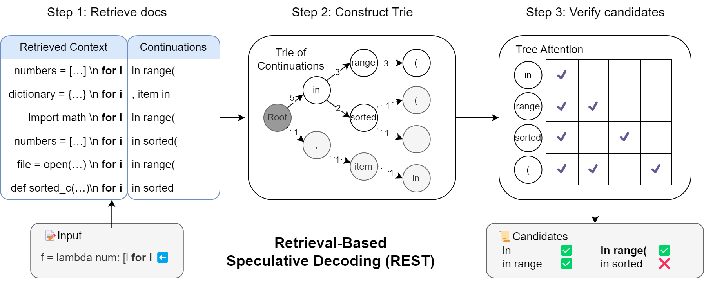
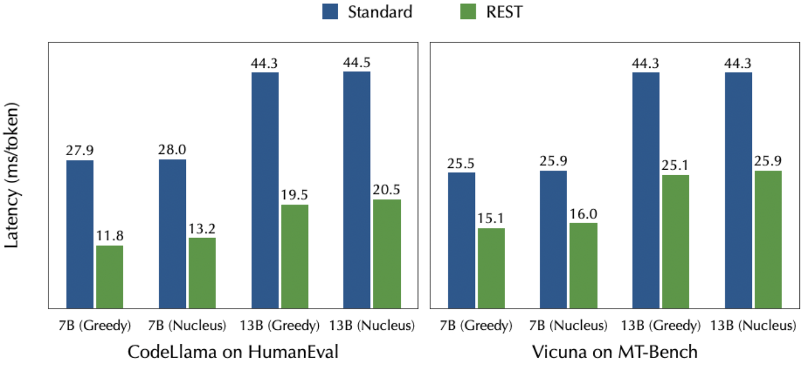

# REST: Retrieval-Based Speculative Decoding

***If training's got you in a stew, take a REST and speed right through.***

[[Paper](https://arxiv.org/abs/2311.08252)] [[Blog](https://sites.google.com/view/rest-llm/)]

## Introduction

REST is a retrieval-based speculative decoding method designed to boost generation speed of LLMs. Instead of relying on a draft language model like speculative decoding, REST utilizes a datastore to retrieve and employ draft tokens. Moreover, REST differs from blockwise parallel decoding and Medusa in that it doesn't require extra training steps. It functions as a plug-and-play solution capable of **accelerating any pre-existing language model**.

<div align="center">
  <picture>
  
  </picture>
  <br>
  <div align="left" width="80%">
  <em>Overview of REST. During inference, the input context is utilized as the query to retrieve docs from the datastore that match the longest suffix of the input. A Trie is constructed using the continuations from the retrieved docs and low-frequency branches are pruned. Candidates from the pruned subtree will be further fed into the LLM with a tree attention mask for verification. All correct tokens from the start will be accepted, and the draft tokens after the first mistake will be rejected.</em>
  </div>
  <br>
</div>

<div align="center">
  <picture>
  
  </picture>
  <br>
  <div align="left" width="40%">
  <em>Speed on HumanEval and MT-Bench with standard autoregressive generation and REST. The temperature is set to 0.8 and the top-p to 0.95 for nucleus sampling in HumanEval. For MT-Bench, the settings are 0.7 for temperature and 0.8 for top-p. All the experiments are conducted on a single NVIDIA A6000 GPU and 96 CPU cores with a batch size of 1.</em>
  </div>
  <br>
</div>

<!-- <p align="center">
  <picture>
  
  </picture>
</p> -->

## Contents
- [Introduction](#introduction)
- [Contents](#contents)
- [Installation](#installation)
- [Build datastores](#Build-datastore)
  - [Build a small one](#Build-a-small-one)
  - [Build a large one](#Build-a-large-one)
- [Inference](#Inference)
  - [Inference on MT-Bench](#Inference-on-MT-Bench)
  - [Inference on HumanEval](#Inference-on-HumanEval)
  - [Free Chat](#Free-Chat)
- [Citation](#citation)
- [Other Models and Datastore](#other-models-and-datastore)
- [Acknowledgements](#acknowledgements)

## Installation
```bash
conda create -n rest python=3.9
conda activate rest
pip3 install -r requirements.txt # pay attention to Pytorch CUDA version
pip3 install DraftRetriever/wheels/draftretriever-0.1.0-cp39-cp39-manylinux_2_34_x86_64.whl
```

## Build datastore

### Build a small one
Build a chat datastore using data from [ShareGPT](https://huggingface.co/datasets/Aeala/ShareGPT_Vicuna_unfiltered) within 10 minutes (requires 465MB disk storage)
```bash
cd datastore
python3 get_datastore_chat.py --model-path lmsys/vicuna-7b-v1.5 # get datastore_chat_small.idx in this folder
```
Build a Python code generation datastore from [The Stack](https://huggingface.co/datasets/bigcode/the-stack) within 20 minutes (requires 924MB disk storage)
```bash
cd datastore
python3 get_datastore_code.py --model-path codellama/CodeLlama-7b-instruct-hf # get datastore_code_small.idx in this folder
```

### Build a large one
(optionally) Build a chat datastore using data from [UltraChat](https://huggingface.co/datasets/stingning/ultrachat) (requires 12GB disk storage)
```bash
cd datastore
python3 get_datastore_chat.py --model-path lmsys/vicuna-7b-v1.5 --large-datastore True # get datastore_chat_large.idx in  this folder
```
(optionally) Build a Python code generation datastore from [The Stack](https://huggingface.co/datasets/bigcode/the-stack) (requires 27GB disk storage)
```bash
cd datastore
python3 get_datastore_code.py --model-path codellama/CodeLlama-7b-instruct-hf --large-datastore True # get datastore_code_large.idx in this folder
```

## Inference

### Inference on MT-Bench
```bash
cd llm_judge
RAYON_NUM_THREADS=6 CUDA_VISIBLE_DEVICES=0 python3 get_model_answer_rest.py --model-path lmsys/vicuna-7b-v1.5 --model-id vicuna-7b-v1.5 --datastore-path ../datastore/datastore_chat_small.idx
```

### Inference on HumanEval
```bash
cd human_eval
RAYON_NUM_THREADS=6 CUDA_VISIBLE_DEVICES=0 python3 rest_test.py --model-path codellama/CodeLlama-7b-instruct-hf --datastore-path ../datastore/datastore_code_small.idx
```

### Free Chat
```bash
RAYON_NUM_THREADS=6 CUDA_VISIBLE_DEVICES=0 python3 -m rest.inference.cli --datastore-path datastore/datastore_chat_small.idx --base-model lmsys/vicuna-7b-v1.5
```

Note that the RAYON_NUM_THREADS environment variable control the maximum number of threads for retrieval. You can adjust it based on your machine.


## Other Models and Datastore
In the examples above, we default to use Vicuna and CodeLlama. But actually you can use any LLaMA-based models you like by simply changing the "--model-path" argument. You can also build the datastore from any data you like. If you want to use architectures other than LLaMA, you can also modify the file model/modeling_llama_kv.py to match the corresponding model.

## Citation
TODO

## Acknowledgements
The codebase is from [Medusa](https://github.com/FasterDecoding/Medusa) and influenced by remarkable projects from the LLM community, including [FastChat](https://github.com/lm-sys/FastChat), [TinyChat](https://github.com/mit-han-lab/llm-awq/tree/main/), [vllm](https://github.com/vllm-project/vllm) and many others.

